# Python Executor Architecture — Clean Redesign v2

> This replaces the JS risk engine and trading logic entirely.  
> Python = Executor + Feed Handler. JS = Brain (auth, routing, frontend proxy).

---

## Design Principles

1. **Python owns all order state** — No JS order tracking, no JS trade execution
2. **Feed-driven state machine** — Order state transitions come from the exchange feed, not from REST responses (proven pattern from `market_maker.py`)
3. **Redis is the message bus** — No direct process-to-process calls
4. **JS is stateless for trading** — It forwards commands, subscribes to Redis events, proxies to frontend WS
5. **Reuse proven patterns** — `OrderState`, `RateLimiter`, supervisor, `BinanceWebsocket`, `BinanceFutures` REST client
6. **PostgreSQL via SQLAlchemy** — Both JS (Prisma) and Python (SQLAlchemy) access the same PostgreSQL DB
7. **Binance-native symbols** — `BTCUSDT` everywhere in Python, no ccxt format
8. **Python owns user stream exclusively** — JS never creates listen keys or connects to Binance WS
9. **L1 orderbook is the single price source** — No `@markPrice` stream needed
10. **Event-carried account state** — Fill/close events carry full account snapshot for idempotent frontend updates

---

## System Flow

```
Frontend ──HTTP──▶ JS Express ──Redis CMD──▶ Python Executor
                                                  │
                                      ┌───────────┼────────────┐
                                      │           │            │
                                FeedHandler   OrderManager  RiskEngine
                                      │           │            │
                                      └───────────┼────────────┘
                                                  │
                                          Redis PUB events
                                                  │
                    JS Express ◀──Redis SUB──────┘
                         │
                    Frontend ◀──WebSocket──┘
```

---

## Component Architecture

```mermaid
graph TB
    subgraph "Python Process (single, uvloop)"
        MAIN["main.py<br/>Unified entry point"]
        
        subgraph "Layer 1: Feeds"
            MDS["MarketDataService<br/>L1 from existing depth handler<br/>best bid/ask from orderbook"]
        end
        
        subgraph "Layer 2: Order Management (core)"
            OM["OrderManager<br/>Central order state machine<br/>Reused from market_maker OrderState"]
            OT["OrderTracker<br/>Map&lt;clientOrderId → OrderState&gt;<br/>Map&lt;exchangeOrderId → OrderState&gt;"]
            EX["ExchangeClient<br/>Wraps BinanceFutures REST<br/>Rate limiter, retry, batch"]
        end
        
        subgraph "Layer 3: Algo Engines"
            CHASE["ChaseEngine"]
            SCALP["ScalperEngine"]
            TWAP["TwapEngine"]
            TRAIL["TrailStopEngine"]
        end
        
        subgraph "Layer 4: Risk"
            RISK["RiskEngine<br/>PositionBook, margin, liq calc"]
            PB["PositionBook<br/>In-memory position tracking"]
        end
        
        subgraph "Layer 5: Command Handler"
            CMD["CommandHandler<br/>Redis BLPOP → dispatch"]
            API["Control API<br/>aiohttp :8888 (optional)"]
        end
    end
    
    MAIN --> MDS
    MAIN --> USS
    MAIN --> OM
    MAIN --> RISK
    MAIN --> CMD
    
    USS -->|ORDER_TRADE_UPDATE| OM
    USS -->|ACCOUNT_UPDATE| RISK
    MDS -->|L1 bid/ask| RISK
    MDS -->|L1 bid/ask| CHASE
    MDS -->|L1 bid/ask| TRAIL
    
    CMD -->|trade commands| OM
    OM -->|place/cancel| EX
    OM -->|state changes| OT
    
    CHASE --> OM
    SCALP --> OM
    TWAP --> OM
    TRAIL --> OM
```



---

## Layer 1: Feed Handler

### MarketDataService (L1 Orderbook)
**Reuses**: `market_data/exchanges/binance.py` (existing depth handler), `market_data/exchanges/reddis_store.py` (existing Redis store)

- **No `@markPrice` stream needed** — L1 orderbook is the single price source
- Wraps existing `BinanceFutures` depth handler which already processes `@depth@100ms`
- Extracts best bid/ask from `orderbook.bids[0]` / `orderbook.asks[0]` on every update
- Dynamic subscription: add/remove symbols based on active positions + active algos
- Publishes L1 to Redis: `pms:price:{symbol}` = `{bid, ask, mid, ts}`
- Emits internal events: `on_price_tick(symbol, bid, ask, mid)`

> Frontend handles its own Binance WS streams for display. Python never pushes PnL/margin to frontend.

### UserStreamService  
**Reuses**: `oms/binance_wss.py` — listen key management, message routing, data mapping

- Connects to `wss://fstream.binance.com/ws/{listenKey}`
- Keepalive every 30 min
- Routes events to OrderManager + RiskEngine:
  - `ORDER_TRADE_UPDATE` → `order_manager.on_order_update(mapped_data)`
  - `ACCOUNT_UPDATE` → `risk_engine.on_account_update(mapped_data)` (reconciliation)
  - `TRADE_LITE` → `order_manager.on_order_update(mapped_lite_data)`
- **Already has**: `map_order_data_ws()`, `map_position_data_ws()`, `map_order_data_lite_ws()` in `binance_wss.py`

---

## Layer 2: Order Management (THE CORE)

### OrderState — Reused from market_maker.py

```python
@dataclass
class OrderState:
    """Universal order state — tracks every order across all algo types"""
    
    # Identity
    client_order_id: str                  # PMS_{subAccountId[:8]}_{type}_{uuid}
    exchange_order_id: Optional[str] = None
    sub_account_id: str = ""
    
    # Order details
    symbol: str = ""
    side: str = ""                        # BUY / SELL
    order_type: str = "LIMIT"             # LIMIT / MARKET
    quantity: float = 0.0
    price: Optional[float] = None
    
    # State machine
    state: str = "idle"                   # idle → placing → active → cancelling → filled → cancelled → expired
    
    # Tracking
    filled_qty: float = 0.0
    avg_fill_price: float = 0.0
    last_fill_price: float = 0.0
    last_fill_qty: float = 0.0
    
    # Metadata
    origin: str = "MANUAL"                # MANUAL / CHASE / SCALPER / TWAP / TRAIL_STOP / BASKET
    parent_id: Optional[str] = None       # Parent algo ID (chase_id, scalper_id, etc.)
    created_at: float = 0.0
    updated_at: float = 0.0
    
    # Callbacks (for algo engines)
    on_fill: Optional[Callable] = None
    on_cancel: Optional[Callable] = None
    on_partial: Optional[Callable] = None
```

### OrderManager — Central State Machine

```python
class OrderManager:
    """
    THE central nervous system for all orders.
    Every order (market, limit, chase, scalper, TWAP, etc.) goes through here.
    
    Key insight from market_maker:
    - State transitions come from the FEED, not from REST responses
    - REST response only moves idle → placing
    - Feed confirms placing → active, and active → filled/cancelled
    """
    
    def __init__(self, exchange_client, redis_client):
        self._orders: Dict[str, OrderState] = {}           # client_order_id → OrderState
        self._exchange_index: Dict[str, str] = {}           # exchange_order_id → client_order_id
        self._sub_account_index: Dict[str, Set[str]] = {}   # sub_account_id → set of client_order_ids
        self._symbol_index: Dict[str, Set[str]] = {}        # symbol → set of client_order_ids
        self._exchange = exchange_client
        self._redis = redis_client
    
    # ── Place Orders ──
    
    async def place_market_order(self, sub_account_id, symbol, side, quantity, **kwargs) -> OrderState:
        """Place a market order through the exchange and track it"""
        order = OrderState(
            client_order_id=self._generate_client_id(sub_account_id, "MKT"),
            sub_account_id=sub_account_id,
            symbol=symbol,
            side=side,
            order_type="MARKET",
            quantity=quantity,
            state="placing",
            origin=kwargs.get("origin", "MANUAL"),
            created_at=time.time(),
        )
        self._register(order)
        
        try:
            result = await self._exchange.create_market_order(symbol, side, quantity, 
                                                                newClientOrderId=order.client_order_id)
            order.exchange_order_id = str(result.get("orderId", ""))
            self._exchange_index[order.exchange_order_id] = order.client_order_id
            # Don't set state to "active" — wait for feed confirmation
        except Exception as e:
            order.state = "failed"
            await self._publish_event("order_failed", order, error=str(e))
        
        return order
    
    async def place_limit_order(self, sub_account_id, symbol, side, quantity, price, **kwargs) -> OrderState:
        """Place a limit order and track it"""
        # Similar to market but with price + newClientOrderId
        ...
    
    async def cancel_order(self, client_order_id: str) -> bool:
        """Cancel an order — sets state to 'cancelling', waits for feed confirmation"""
        order = self._orders.get(client_order_id)
        if not order or order.state not in ("active", "placing"):
            return False
        order.state = "cancelling"
        try:
            await self._exchange.cancel_order(order.symbol, orderId=order.exchange_order_id)
        except Exception:
            pass  # Feed will confirm actual state
        return True
    
    async def replace_order(self, client_order_id: str, new_price: float) -> OrderState:
        """Cancel + replace (chase pattern from market_maker)"""
        old = self._orders.get(client_order_id)
        if not old:
            return None
        await self.cancel_order(client_order_id)
        return await self.place_limit_order(
            old.sub_account_id, old.symbol, old.side, old.quantity, new_price,
            origin=old.origin, parent_id=old.parent_id,
            on_fill=old.on_fill, on_cancel=old.on_cancel
        )
    
    # ── Feed-Driven State Transitions ──
    
    async def on_order_update(self, data: dict):
        """Called by UserStreamService on ORDER_TRADE_UPDATE"""
        exchange_order_id = str(data.get("exchange_order_id", ""))
        client_order_id = data.get("client_order_id", "")
        status = data.get("status", "")
        
        # Lookup order
        order = self._lookup(exchange_order_id, client_order_id)
        if not order:
            return  # Not our order
        
        old_state = order.state
        
        if status == "NEW":
            order.state = "active"
            order.exchange_order_id = exchange_order_id
            self._exchange_index[exchange_order_id] = order.client_order_id
            
        elif status == "FILLED":
            order.state = "filled"
            order.filled_qty = data.get("filled_qty", order.quantity)
            order.avg_fill_price = data.get("avg_price", 0)
            order.last_fill_price = data.get("last_fill_price", 0)
            order.last_fill_qty = data.get("last_fill_qty", 0)
            if order.on_fill:
                await order.on_fill(order)
                
        elif status == "PARTIALLY_FILLED":
            order.last_fill_price = data.get("last_fill_price", 0)
            order.last_fill_qty = data.get("last_fill_qty", 0)
            order.filled_qty += order.last_fill_qty
            if order.on_partial:
                await order.on_partial(order)
                
        elif status in ("CANCELED", "EXPIRED", "REJECTED"):
            order.state = "cancelled"
            if order.on_cancel:
                await order.on_cancel(order, status)
        
        order.updated_at = time.time()
        
        # Publish state change to Redis → JS → Frontend
        await self._publish_event(f"order_{order.state}", order)
    
    # ── Redis Event Publishing ──
    
    async def _publish_event(self, event_type: str, order: OrderState, **extra):
        """
        Publish order event to Redis for JS to forward to frontend.
        
        KEY DESIGN: Events carry full account state (balance, positions, margin)
        so frontend can update locally without refetching /margin endpoint.
        Frontend only fetches /margin on page refresh (cold start).
        """
        # Get account snapshot for idempotent frontend update
        account_state = {}
        if self._risk and event_type in ("order_filled", "order_cancelled", "position_closed", "position_reduced"):
            account_state = self._risk.get_account_snapshot(order.sub_account_id)
        
        payload = {
            "type": event_type,
            "subAccountId": order.sub_account_id,
            "clientOrderId": order.client_order_id,
            "exchangeOrderId": order.exchange_order_id,
            "symbol": order.symbol,
            "side": order.side,
            "orderType": order.order_type,
            "quantity": order.quantity,
            "price": order.price,
            "state": order.state,
            "filledQty": order.filled_qty,
            "avgFillPrice": order.avg_fill_price,
            "origin": order.origin,
            "parentId": order.parent_id,
            "timestamp": time.time(),
            # Event-carried account state (idempotent frontend updates)
            "account": account_state,  # { balance, equity, marginUsed, availableMargin }
            **extra,
        }
        await self._redis.publish(f"pms:events:{event_type}", json.dumps(payload))
```

### ExchangeClient — Wraps BinanceFutures REST
**Reuses**: `oms/binance_futures.py` (complete REST client already exists 469 lines), `market_maker._place_order_with_latency` (retry + backoff)

```python
class ExchangeClient:
    """Async wrapper around BinanceFutures with rate limiting and retry"""
    
    def __init__(self, api_key, api_secret):
        self._client = BinanceFutures(api_key, api_secret)
        self._rate_limiter = RateLimiter(max_requests=20, window_size=1.0)
    
    async def create_market_order(self, symbol, side, quantity, **kwargs):
        """Place market order with retry and rate limit"""
        await self._rate_limiter.acquire()
        return await self._with_retry(
            lambda: self._client.create_market_order(symbol, side, quantity, **kwargs)
        )
    
    async def create_limit_order(self, symbol, side, quantity, price, **kwargs):
        await self._rate_limiter.acquire()
        return await self._with_retry(
            lambda: self._client.create_limit_order(symbol, side, quantity, price, **kwargs)
        )
    
    async def cancel_order(self, symbol, orderId=None, origClientOrderId=None):
        await self._rate_limiter.acquire()
        return await self._with_retry(
            lambda: self._client.cancel_order(symbol, orderId=orderId, origClientOrderId=origClientOrderId)
        )
    
    async def _with_retry(self, fn, max_retries=3, base_delay=0.5):
        """Retry with exponential backoff (from market_maker pattern)"""
        for attempt in range(max_retries):
            try:
                return await asyncio.to_thread(fn)  # BinanceFutures is sync, wrap in thread
            except Exception as e:
                if attempt < max_retries - 1:
                    await asyncio.sleep(base_delay * (2 ** attempt))
                else:
                    raise
```

---

## Layer 3: Algo Engines

Each algo engine owns its strategy logic but delegates ALL order operations to `OrderManager`:

### ChaseEngine
```python
class ChaseEngine:
    def __init__(self, order_manager, market_data):
        self._order_manager = order_manager
        self._market_data = market_data
        self._active_chases: Dict[str, ChaseState] = {}
    
    async def start_chase(self, sub_account_id, symbol, side, quantity, leverage, stalk_offset, stalk_mode, max_distance):
        chase = ChaseState(id=gen_id(), ...)
        order = await self._order_manager.place_limit_order(
            sub_account_id, symbol, side, quantity, price=compute_target(...),
            origin="CHASE", parent_id=chase.id,
            on_fill=lambda o: self._on_chase_filled(chase, o),
            on_cancel=lambda o, r: self._on_chase_cancelled(chase, o, r),
        )
        chase.current_order = order
        # Subscribe to price ticks for repricing
        self._market_data.subscribe(symbol, lambda p: self._on_price(chase, p))
    
    async def _on_price(self, chase, price_data):
        """Reprice if needed (reusing market_maker cancel-before-reprice pattern)"""
        new_target = compute_target(chase, price_data)
        if should_reprice(chase, new_target):
            chase.current_order = await self._order_manager.replace_order(
                chase.current_order.client_order_id, new_target
            )
```

All other algo engines (Scalper, TWAP, TrailStop) follow the same pattern:
- Own their strategy state
- Delegate order operations to `OrderManager`
- Register `on_fill` / `on_cancel` callbacks
- Subscribe to L1 price ticks from `MarketDataService`
- OrderManager handles state tracking and feed confirmation

> **SURF/Pump Chaser is deprecated and removed from the codebase.**

---

## Layer 4: Risk Engine

```python
class RiskEngine:
    def __init__(self, market_data, db):
        self._position_book = PositionBook()  # In-memory, same structure as JS version
        self._market_data = market_data
        self._db = db  # Prisma Python or SQLAlchemy
    
    async def validate_trade(self, sub_account_id, symbol, side, quantity, leverage):
        """Same validation logic as JS TradeValidator"""
        ...
    
    async def on_fill(self, order: OrderState):
        """Called when any order fills — create/update virtual position"""
        ...
    
    async def on_account_update(self, data):
        """Called from UserStreamService ACCOUNT_UPDATE — reconciliation"""
        ...
    
    async def evaluate_risk(self, sub_account_id):
        """Tick-driven risk evaluation — same ADL tiers as JS"""
        ...
```

---

## Layer 5: Command Handler

### Redis Command Consumer
```python
class CommandHandler:
    """Consumes commands from JS via Redis, dispatches to appropriate handler"""
    
    COMMAND_QUEUES = {
        "pms:cmd:trade":         "handle_trade",
        "pms:cmd:close":         "handle_close",
        "pms:cmd:cancel":        "handle_cancel",
        "pms:cmd:chase":         "handle_chase",
        "pms:cmd:scalper":       "handle_scalper",
        "pms:cmd:twap":          "handle_twap",
        "pms:cmd:trail_stop":    "handle_trail_stop",
    }
    
    async def run(self):
        """Main command loop — BLPOP on all queues"""
        while True:
            queue, data = await self._redis.blpop(list(self.COMMAND_QUEUES.keys()))
            command = json.loads(data)
            handler = getattr(self, self.COMMAND_QUEUES[queue])
            
            try:
                result = await handler(command)
                # Write result back for JS to read
                await self._redis.set(
                    f"pms:result:{command['requestId']}", 
                    json.dumps(result), 
                    ex=30
                )
            except Exception as e:
                await self._redis.set(
                    f"pms:result:{command['requestId']}", 
                    json.dumps({"success": False, "error": str(e)}),
                    ex=30
                )
```

---

## Redis Contract — Complete

### Commands (JS → Python)
| Queue | Payload | Handler |
|-------|---------|---------|
| `pms:cmd:trade` | `{ requestId, subAccountId, symbol, side, quantity, leverage, ... }` | `handle_trade` |
| `pms:cmd:close` | `{ requestId, positionId }` | `handle_close` |
| `pms:cmd:cancel` | `{ requestId, orderId }` | `handle_cancel` |
| `pms:cmd:chase` | `{ requestId, subAccountId, symbol, side, quantity, stalkMode, ... }` | `handle_chase` |
| `pms:cmd:scalper` | `{ requestId, subAccountId, symbol, layers, baseOffsetPct, ... }` | `handle_scalper` |
| `pms:cmd:twap` | `{ requestId, subAccountId, symbol, totalSize, lots, duration, ... }` | `handle_twap` |
| `pms:cmd:trail_stop` | `{ requestId, subAccountId, positionId, callbackPct, ... }` | `handle_trail_stop` |

> Basket trades are handled as multiple `pms:cmd:trade` commands by the JS layer.

### Results (Python → JS, request/response)
| Key | TTL | Purpose |
|-----|-----|---------|
| `pms:result:{requestId}` | 30s | One-shot response for each command |

### Events (Python → JS → Frontend, pub/sub broadcast)

All fill/position/algo events carry an `account` field with current account state.
This enables **idempotent frontend updates without refetching /margin**.

| Channel | Payload | JS Action |
|---------|---------|-----------|
| `pms:events:order_filled` | Order state + `account` snapshot | WS broadcast to frontend |
| `pms:events:order_cancelled` | Order + reason | WS broadcast to frontend |
| `pms:events:order_active` | Order confirmed | WS broadcast to frontend |
| `pms:events:position_updated` | Position details + `account` snapshot | WS broadcast |
| `pms:events:position_closed` | Position + PnL + `account` snapshot | WS broadcast |
| `pms:events:position_reduced` | Position + reduced qty + `account` snapshot | WS broadcast |
| `pms:events:chase_progress` | Chase tracking data | WS broadcast |
| `pms:events:scalper_progress` | Scalper status | WS broadcast |
| `pms:events:twap_progress` | TWAP status | WS broadcast |
| `pms:events:trail_stop_progress` | Trail stop tracking | WS broadcast |
| `pms:events:liquidation` | Liquidation details + `account` snapshot | WS broadcast |

> **Removed**: `pnl_update`, `margin_update` — frontend computes PnL locally from its own Binance WS streams.

### `account` Snapshot Shape (carried in events)
```json
{
    "balance": 1000.00,
    "equity": 1001.50,
    "marginUsed": 6.50,
    "availableMargin": 995.00,
    "positions": [
        { "id": "uuid", "symbol": "BTCUSDT", "side": "LONG", "entryPrice": 65000, "quantity": 0.001, "margin": 6.5, "leverage": 10 }
    ]
}
```

### Data Cache (Python writes, JS reads on cold start)
| Key | TTL | Purpose |
|-----|-----|---------|
| `pms:price:{symbol}` | 30s | Latest L1 bid/ask/mid |
| `pms:risk:{subAccountId}` | 30s | Account snapshot for GET /margin fallback |

---

## File Structure

```
trading_engine_python/
├── main.py                          # Unified entry point (uvloop)
├── config.py                        # Root .env loader
│
├── feeds/
│   ├── market_data.py               # Combined WS streams (markPrice, bookTicker)
│   ├── user_stream.py               # Binance user data stream (reuse binance_wss.py)
│   └── subscription_manager.py      # Dynamic symbol subscription
│
├── orders/
│   ├── state.py                     # OrderState dataclass (from market_maker)
│   ├── manager.py                   # OrderManager — central state machine
│   ├── tracker.py                   # OrderTracker — indexes for fast lookup
│   └── exchange_client.py           # Async BinanceFutures wrapper + rate limiter
│
├── algos/
│   ├── chase.py                     # Chase limit engine
│   ├── scalper.py                   # Dual-leg scalper
│   ├── twap.py                      # TWAP + basket
│   └── trail_stop.py                # Trailing stop
│
├── risk/
│   ├── engine.py                    # RiskEngine facade (L1-based sub-account liq)
│   ├── position_book.py             # In-memory position tracking
│   ├── validator.py                 # Pre-trade validation
│   ├── liquidation.py               # ADL tiers on virtual sub-account margin
│   └── math.py                      # Pure PnL/margin calculation functions
│
├── commands/
│   ├── handler.py                   # Redis BLPOP command consumer
│   └── api.py                       # Optional aiohttp control API
│
└── db/
    └── client.py                    # DB access (Prisma Python or async SQLAlchemy)
```

---

## Why This Design Works

### 1. Feed-Driven Order State (from market_maker)
The JS trading routes had a fundamental flaw: they relied on REST responses for order state. The market maker proved that **feed-driven state transitions are more reliable** — the REST call sends the order, but state transitions only happen when the feed confirms (NEW, FILLED, CANCELLED).

### 2. Single OrderManager for All Order Types
Instead of each algo engine (chase, scalper, TWAP) managing its own exchange interaction, they ALL go through `OrderManager.place_limit_order()` / `OrderManager.cancel_order()`. This eliminates:
- Duplicate rate limiting logic
- Duplicate fill detection logic  
- Duplicate retry/backoff logic
- Duplicate Redis persistence logic

### 3. Callback-Based Algo Integration
Each algo registers `on_fill` / `on_cancel` callbacks when placing orders. When the feed confirms a fill, `OrderManager` calls the callback directly. No polling, no sync loops, no circular deps.

### 4. ClientOrderId as Universal Key
Every order gets a `PMS_{subAccountId[:8]}_{type}_{uuid}` client order ID. This enables:
- Instant routing of feed events to the correct sub-account
- Instant lookup of parent algo (CHASE/SCALPER/TWAP)
- No Redis lookup needed for known orders
- Dedup detection built-in

### 5. Existing Python Code Covers 60%+
| Component | Existing Code | Status |
|-----------|--------------|--------|
| WS supervisor + uvloop | `market_data/main.py` | ✅ Ready |
| L1 depth feed + Redis store | `market_data/exchanges/binance.py` + `reddis_store.py` | ✅ Ready |
| Binance REST client | `oms/binance_futures.py` (469 lines) | ✅ Ready |
| User stream + data mapping | `oms/binance_wss.py` (381 lines) | ✅ Ready |
| OrderState pattern | `market_maker.py` OrderState | ✅ Proven |
| Rate limiter | `market_maker.py` RateLimiter | ✅ Proven |
| Retry + backoff | `market_maker.py` `_place_order_with_latency` | ✅ Proven |
| Redis pub/sub | `market_maker.py` + `market_data` | ✅ Proven |
| Risk math | Rewrite from JS (102 lines of pure functions) | 🔨 Trivial |
| Position book | Rewrite from JS (176 lines pure data structure) | 🔨 Trivial |
| Trade validator | Rewrite from JS (142 lines) | 🔨 Trivial |
| Algo engines (chase, scalper, twap, trail) | New code using OrderManager | 🔨 Medium |
| Liquidation engine (L1-based sub-account) | Rewrite from JS (671 lines, simplified) | 🔨 Medium |
