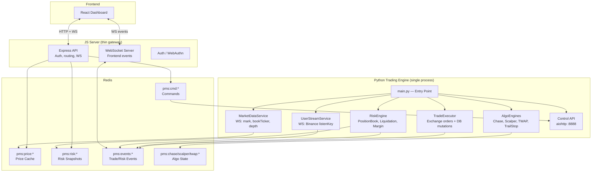

# Python Trading Engine — Updated Architecture & Migration Plan

> Updated from the initial architecture doc to include risk engine + all trading logic in Python.

---

## Target Architecture: `Front → JS → Redis → Python → Redis → JS → Front`



---

## What Stays in JS

| Component | Reason |
|-----------|--------|
| Express API server | Auth, routing, static files — no trading logic |
| WebSocket server (`ws.js`) | Frontend connections, forwarding events from Redis |
| Auth / WebAuthn | Session management |
| Prisma client | JS still reads DB for API responses (eventually Python handles writes) |

## What Moves to Python

| Component | Source | Priority |
|-----------|--------|----------|
| Market data WS | `exchange.js` combined streams | Phase 1 |
| User stream WS | `proxy-stream.js` Binance connection | Phase 1 |
| Price service | `risk/price-service.js` | Phase 2 |
| Risk engine | `risk/index.js` + sub-modules | Phase 2 |
| Trade validator | `risk/trade-validator.js` | Phase 2 |
| Trade executor | `risk/trade-executor.js` | Phase 2 |
| Position book | `risk/position-book.js` | Phase 2 |
| Liquidation engine | `risk/liquidation.js` | Phase 2 |
| Order sync | `order-sync.js` | Phase 2 |
| Position sync | `position-sync.js` | Phase 2 |
| Chase engine | `routes/trading/chase-limit.js` | Phase 3 |
| Scalper engine | `routes/trading/scalper.js` | Phase 3 |
| TWAP engine | `routes/trading/twap.js` | Phase 3 |
| Trail stop | `routes/trading/trail-stop.js` | Phase 3 |
| Market orders route | `routes/trading/market-orders.js` | Phase 3 |
| Limit orders route | `routes/trading/limit-orders.js` | Phase 3 |
| Basket trades | `routes/trading/basket.js` | Phase 3 |

---

## Communication Flow

### JS → Python (Commands)
```
JS API receives HTTP request
  → Publishes command to Redis: pms:cmd:{type}
    → Python subscribes, processes, executes
      → Publishes result to Redis: pms:result:{requestId}
        → JS reads result, responds to HTTP request
```

### Python → JS (Events)
```
Python detects fill / risk change / liquidation
  → Publishes event to Redis: pms:events:{type}
    → JS subscribes, forwards to frontend via WebSocket
```

### Request/Response Flow (Trade)
```
Frontend → POST /api/trade → JS
  JS → RPUSH pms:cmd:trade { requestId, subAccountId, symbol, side, qty, leverage }
  Python ← BLPOP pms:cmd:trade
  Python → validate → execute on exchange → update DB
  Python → SET pms:result:{requestId} { success, orderId, position }
  Python → PUBLISH pms:events:trade_fill { subAccountId, position }
  JS ← GET pms:result:{requestId} (polling or blocking)
  JS → HTTP 201 { success, orderId, position }
  JS ← SUB pms:events:trade_fill → WS broadcast to frontend
```

---

## Phase 1: Feeds (Low Risk)

### Objective
Replace JS WebSocket connections with Python. JS reads from Redis (already does).

### Changes
1. **Python**: Create `MarketDataService` — combined WS streams
2. **Python**: Create `UserStreamService` — Binance user data stream
3. **python → Redis**: Same key format as JS (`pms:price:{ccxtSymbol}`)
4. **JS**: Remove `exchange.js` WS streaming code
5. **JS**: Remove `proxy-stream.js` Binance WS connection, switch to Redis subscriber

### Verification
- Compare price cache values (Python vs old JS)
- Verify order events arrive via Redis channel
- Verify frontend still receives live PnL updates

---

## Phase 2: Risk + Execution (Medium Risk)

### Objective
Move risk evaluation, trade validation, and trade execution to Python.

### Changes
1. **Python**: Port `PositionBook` (in-memory position tracking)
2. **Python**: Port `PriceService` (WS → Redis → REST cascade)
3. **Python**: Port `TradeValidator` (margin, exposure, leverage checks)
4. **Python**: Port `TradeExecutor` (exchange orders + DB mutations)
5. **Python**: Port `LiquidationEngine` (ADL tiers, takeover, instant close)
6. **Python**: Port `order-sync` and `position-sync`
7. **JS**: Trading routes become thin proxies → Redis command → Python

### DB Access
- Python needs DB access (Prisma Python client or SQLAlchemy)
- Postgres URL from `.env`
- Transactions for atomic trade mutations

### Verification
- Unit tests for risk-math (pure functions)
- Integration test: place trade → verify DB state
- Integration test: simulate margin breach → verify liquidation

---

## Phase 3: Algo Engines (High Complexity)

### Objective
Move chase, scalper, TWAP, trail stop engines to Python.

### Changes
1. **Python**: Port chase engine
2. **Python**: Port scalper engine
3. **Python**: Port TWAP engine
4. **Python**: Port trail stop engine
5. **Python**: Port basket trades
6. **JS**: Remove trading route handlers, keep API routing → Redis

### Verification
- Start/cancel each algo via API
- Verify Redis persistence + resume on restart
- Verify fill detection + position creation

---

## File Structure (Final Target)

```
trading_engine_python/
├── main.py                          # Unified entry point
├── config.py                        # Root .env loader
├── feeds/
│   ├── market_data_service.py       # Combined WS streams (mark, bookTicker, depth)
│   ├── user_stream_service.py       # Binance user data stream
│   └── exchanges/
│       ├── binance.py               # Existing depth handler
│       ├── exchange_base.py         # Existing base class
│       └── redis_store.py           # Existing Redis store
├── risk/
│   ├── engine.py                    # RiskEngine facade
│   ├── position_book.py             # In-memory position tracking
│   ├── price_service.py             # Price resolution cascade
│   ├── trade_validator.py           # Pre-trade validation
│   ├── trade_executor.py            # Trade execution + DB
│   ├── liquidation.py               # Liquidation engine + ADL
│   └── risk_math.py                 # Pure calculation functions
├── algos/
│   ├── chase.py                     # Chase limit engine
│   ├── scalper.py                   # Dual-leg scalper
│   ├── twap.py                      # TWAP + basket
│   ├── trail_stop.py                # Trailing stop
│   └── basket.py                    # Multi-leg basket
├── exchange/
│   ├── connector.py                 # Exchange REST client (ccxt or raw)
│   └── batch.py                     # Batch order helpers
├── sync/
│   ├── order_sync.py                # Pending order monitoring
│   └── position_sync.py             # Exchange position reconciliation
├── api/
│   ├── control.py                   # aiohttp REST API
│   └── redis_commands.py            # Redis command consumer
└── db/
    └── prisma.py                    # DB access (Prisma Python or SQLAlchemy)
```

---

## Open Decisions

1. **DB Access**: Prisma Python client vs SQLAlchemy? Prisma Python is newer but matches existing schema.
2. **Exchange Client**: Use Raw Binance API? CCXT gives compatibility, raw gives speed.
3. **Process Management**: Node should start the Python process on startup ?
4. **Hot Migration**: Do everything straigth out of the box.
5. **Frontend Events**: Does Python publish the same WS event shapes, or does JS transform? We might need to refactor logic and primitives to make all of this work. Let's discuss
